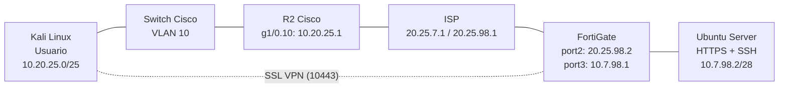

# VPN de acceso remoto con FortiGate: HTTPS sin VPN y SSH por VPN

Laboratorio de Seguridad de Redes (Infraestructura 3): un servidor web publica **HTTPS sin necesidad de VPN** y **SSH solo a través de una VPN de acceso remoto (Remote-Site)** terminada en un **FortiGate** configurado por GUI. Un router y un switch Cisco aportan la red del usuario y un ISP con IP públicas interconecta ambos lados.

<!-- VIDEO: agregar aquí el enlace del video demostrativo -->

## Propósito del laboratorio

Demostrar cómo un firewall puede publicar un servicio (HTTPS) mediante una virtual IP y, al mismo tiempo, reservar un servicio administrativo (SSH) exclusivamente para usuarios autenticados por VPN. El usuario (Kali Linux, VLAN 10) está detrás de un router Cisco; el servidor (Ubuntu Server con Apache2 y OpenSSH) está detrás del FortiGate. Todo el direccionamiento se construyó a partir de la matrícula 20250798.

### Objetivos

- El usuario accede al servidor web (HTTPS) sin necesidad de VPN.
- El usuario accede al servidor por SSH únicamente mediante la VPN.
- Configurar el FortiGate por GUI: interfaces, rutas, virtual IP, políticas y VPN Remote-Site.
- Configurar el equipo de red Cisco (solo red): VLAN 10, DHCP y NAT.
- Configurar el ISP con IP públicas.
- Publicar un servidor /28 con HTTPS y SSH, y una red de usuarios /25 con VLAN 10, DHCP y traceroute.

---

## Topología

Port1 del FortiGate está conectado a un nodo Cloud y se usa solo para acceder a su GUI.

## Direccionamiento

| Enlace / Red | Red | Extremo A | Extremo B |
|---|---|---|---|
| ISP - R2 | 20.25.7.0/30 | ISP f0/0: 20.25.7.1 | R2 f0/0: 20.25.7.2 |
| ISP - FortiGate | 20.25.98.0/30 | ISP g1/0: 20.25.98.1 | FortiGate port2: 20.25.98.2 |
| LAN usuarios (VLAN 10) | 10.20.25.0/25 | R2 g1/0.10: 10.20.25.1 | Kali: DHCP (.10 a .100) |
| LAN servidor | 10.7.98.0/28 | FortiGate port3: 10.7.98.1 | Ubuntu Server: 10.7.98.2 |
| Pool de clientes VPN | 10.7.25.10 a 10.7.25.20 | FortiGate (ssl.root) | Kali (ppp0) |

## Tecnologías

GNS3, VMware, FortiGate VM 7.0.9, Cisco IOS, Kali Linux, Ubuntu Server, Apache2, OpenSSH, openfortivpn.

---

## Qué se configuró

- **ISP:** direccionamiento público en f0/0 y g1/0.
- **Switch Cisco:** VLAN 10, puerto access hacia Kali y trunk 802.1Q hacia R2.
- **R2 (Cisco, solo red):** subinterfaz `g1/0.10` con `dot1Q 10`, servidor DHCP y NAT overload hacia el ISP. Se retiró la configuración de la VPN site-to-site de la práctica anterior.
- **FortiGate (GUI):**
  - Interfaces WAN y LAN, ruta por defecto por port2 y gateway DHCP de port1 desactivado.
  - Virtual IP `VIP-HTTPS` (20.25.98.2:443 hacia 10.7.98.2:443) y política `WAN-to-WEB` con la virtual IP como destino.
  - SSL VPN en `port2` puerto 10443, portal `full-access` con túnel dividido, usuario `vpnuser`, grupo `SSL-VPN-Users` y política `VPN-to-SSH` (SSH y PING desde `ssl.root`).
- **Servidor:** IP estática con Netplan, Apache2 con HTTPS y OpenSSH.
- **Usuario:** Kali con IP por DHCP y cliente `openfortivpn`.

## Rutas de acceso al servidor

| Servicio | Cómo se accede | Requiere VPN |
|---|---|---|
| HTTPS | `https://20.25.98.2` (virtual IP en el FortiGate) | No |
| SSH | `ssh usuario@10.7.98.2` dentro de la SSL VPN | Sí |

No existe ninguna virtual IP para el puerto 22, por lo que el SSH no está expuesto en la dirección pública.

## Pruebas

- **HTTPS sin VPN:** `curl -k https://20.25.98.2` desde Kali devuelve la página del servidor.
- **NAT en R2:** Kali (10.20.25.10) aparece traducido a 20.25.7.2 en `show ip nat translations`.

<!-- COMPLETAR cuando estén listas las pruebas:
- Traceroute sin VPN hacia 20.25.98.2.
- Intentos de SSH sin VPN (deben fallar).
- Conexión de openfortivpn (ppp0 con IP 10.7.25.x).
- SSH exitoso a 10.7.98.2 con la VPN activa y traceroute con la VPN. -->

Las capturas de cada prueba están en el PDF de documentación.

## Problemas encontrados y soluciones

1. **HTTPS por la IP pública no respondía.** La política `WAN-to-WEB` tenía como destino `all`. Solución: usar `VIP-HTTPS` como destino.
2. **Conflicto del puerto 443.** La SSL VPN chocaba con el HTTPS administrativo y con la virtual IP. Solución: mover la SSL VPN al puerto 10443.
3. **NAT duplicado en R2.** Había dos reglas de traducción. Solución: dejar una sola.
4. **Túnel IPsec anterior con referencias.** No se podía borrar mientras otros objetos lo usaban. Solución: eliminar primero las políticas; el túnel quedó inactivo.
5. **Cliente VPN rechazado por versión de TLS.** Error `tlsv1 alert protocol version` en `openfortivpn`.

<!-- COMPLETAR el problema 5 con la causa y la solución aplicada -->

## Archivos de configuración

| Archivo | Descripción |
|---|---|
| `R2-config-infra3.txt` | Router Cisco R2 (VLAN 10, DHCP y NAT) |
| `ISP-config.txt` | ISP con IP públicas |
| `Switch-config.txt` | Switch Cisco (VLAN 10, access y trunk) |
| `netplan-ubuntu-infra3.yaml` | IP estática del servidor |
| `servidor-comandos-infra3.txt` | Comandos de HTTPS y SSH del servidor |
| `FortiGate-config-referencia.txt` | Referencia en CLI de lo configurado por GUI |
| `FortiGate-config.conf` | Backup del FortiGate exportado desde la GUI (claves ocultas) |

> No se usaron scripts automatizados. El FortiGate se configuró por GUI y el resto de equipos con los archivos de configuración de este repositorio.

---

**Autor:** Emmanuel Orlando Rodríguez Núñez - 20250798
**Materia:** Seguridad de Redes
